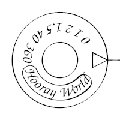
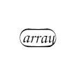
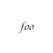
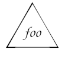

# Mystical
(An alternate code formatting mode for PostScript)

big pretty example

I wanted to make a programming language that resembled magical circles. This is more like a way to write PostScript that looks like a magical circle, but I will refer to it as Mystical in this document.

## Rings
The structure of Mystical is based on rings. These are circular bands of text and sigils, with an inner and outer border. The content of the main ring of a program starts at the rightmost (3:00) point and flow continues widdershins (counter-clockwise) both to respect postscript's angles and to reflect the assumption that these rings should be written from the outside.  Subsidiary rings start from their attachment point to their caller. 

There are three types of rings in Mystical:
* executable arrays, written in {} in ps, are represented with simple circular borders on the inside and outside of the ring, with a star of some sort inside. The start/end point is marked by a symbol based on the "work complete" symbol from alchemy. 
* non-executable arrays, written in [] in ps, are the same but without the star. The start/end point is marked with a simple triangle. 
* dictionaries, written in << >> in ps, are polygons with a double outer border and a single inner border. The start/end point is marked the same as the array. 

| xarray | array | dict |
|--|--|--|
|  |  |  |
| `{ 0 0 currentlinewidth 1.5 mul 0 360 arc fill }` | `[ 0 1 2 1.5 40 360 (Hooray World) ]` | `<< /longname (Mystical) /w 45 /h 8 /x 23 >>` |

When one of these structures appear inside a different structure, a small circle or dot at the inclusion point is connected to a line which leads to the subsidiary ring's start/end sigil.


```
[
    0 1 2 1.5 40 360 <<
        /longname (Mystical) /w 45 /h 8 /x 23
    >>
]
```

It is theoretically possible to use [ ] and << >> in ps in ways that Mystical can't handle:
```
[ 1 2 3 split { ] /first exch def [ } if 4 5 6 ] /final exch def
```
so don't do that.

Other commands like `gsave/grestore` and `begin/end` are more likely to be used in non-balanced or loop-crossing ways so those are treated as normal sigils below.

## Text and Sigils
The rings' rims contain text or sigils.  Sigils are symbols that stand in for operators, variables, or other keywords. Any name, written in ps as `/name`, is instead written with a triangle surrounding or superimposing the text of the name or its sigil.  Any strings, written in () in Postscript, are cartouche-like shapes containing the string text.

| array | /array | (array) | foo | /foo | /foobar |
|--|--|--|--|--|--|
|  |  |  |  |  |  |

### Standard Sigils
Many built-in operators have been given their own sigils.  These are used in place of the text of the operator if it appears as a name or operator (but not if it appears as a string).  I have generally made these sigils based on the initial of the command and an illustration of the concept, though in some cases I have taken a more fully illustrative route or created some standard visual language.

in order from ps ref

### User Sigils
Sigils for new functions or names can be added to `sigil_bank` at runtime.  They should fit into the 1-unit square centered on the origin, so no coordinate should be more than 0.5 (of course, you can transform your coordinate system for convenience).  If you use `nstroke` instead of `stroke` you will get the same calligraphic effect as the standard sigils.

Sigils for user variables can be designed with any sigil system.  My examples mostly use letter collision, inspired by Spare's Chaos Magick system, but anything that turns a word into a symbol will work - kameas, wheels, Square Word Calligraphy, Circular Gallifreyan, sitelen sitelen, illustration, puns, etc.  New names based on official operators can incorporate the standard sigils for those operators.

| arg | dot | softscale | nstroke |
|--|--|--|--|

## Ligature for /name { circle } def

There is a sigil for `def` but a very common pattern is to push a name, push a function, and def the name to the function. To save space and to emphasize this definition, there is special syntax for this case consisting of the usual name triangle with the end of the link line directly below it, and the def sigil is omitted entirely. This is extended to the other two circle types for simplicity. Any other use of `def` will just use the def sigil as normal.

def-ligature example

This only applies inside of executable arrays. I considered a similar ligature for /name { circle } in dictionaries but there's too much chance of getting it wrong.

## Sample Algorithms

Euclid's gcd
dot
quicksort

## Could this work for other languages?
This approach seems applicable to other language with just operators, such as Forth. Languages with more complicated statements might be more difficult, and I don't know if a new circle for every brace or indent will be overly busy.
