# Mystical

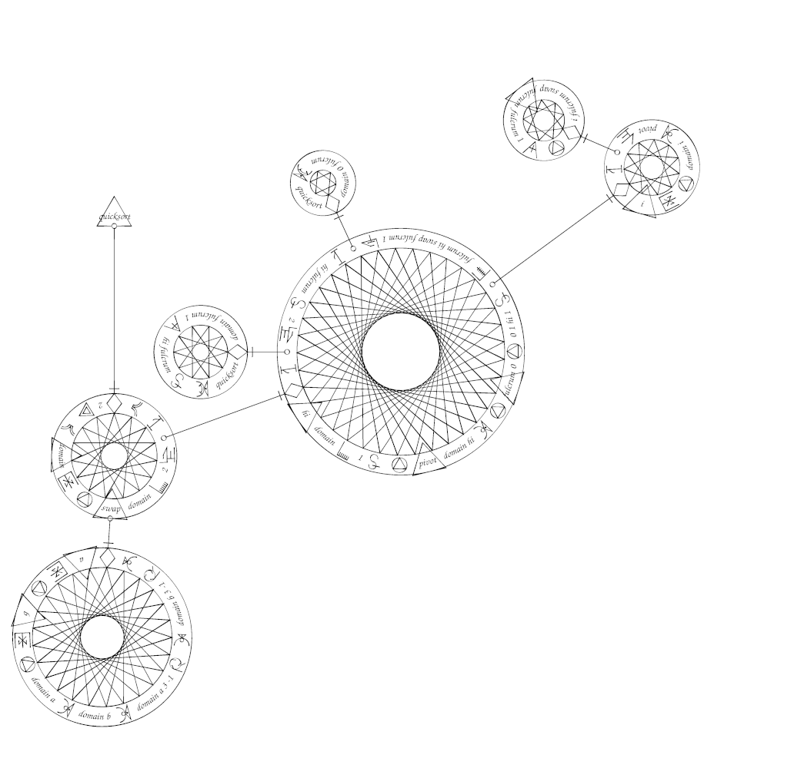

I wanted to make a programming language that resembled magical circles. This is more like a way to write PostScript that looks like a magical circle, but I will refer to it as Mystical in this document.

## Getting started

There is an [installation](INSTALL.md) document and a [getting started](docs/intro.md) document available.  Read on for a language specification.

## Rings
The structure of Mystical is based on rings. These are circular bands of text and sigils, with an inner and outer border. The content of the main ring of a program starts at the rightmost (3:00) point and flow continues widdershins (counter-clockwise) both to respect PostScript's angles and to reflect the assumption that these rings should be written from the outside.  Subsidiary rings start from their attachment point to their caller. 

There are three types of rings in Mystical:
* executable arrays, written in `{` `}` in PostScript, are represented with simple circular borders on the inside and outside of the ring, with a star of some sort inside. The start/end point is marked by a symbol based on the "work complete" symbol from alchemy. 
* non-executable arrays, written in `[` `]` in PostScript, are the same but without the star. The start/end point is marked with a simple triangle. 
* dictionaries, written in `<<` `>>` in PostScript, are polygons with a double outer border and a single inner border. The start/end point is marked the same as the array. 

| xarray | array | dict |
|--|--|--|
| 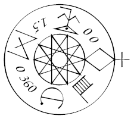 |  | 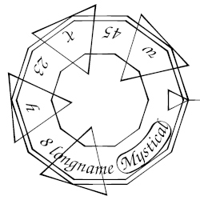 |
| `{ 0 0 currentlinewidth 1.5 mul 0 360 arc fill }` | `[ 0 1 2 1.5 40 360 (Hooray World) ]` | `<< /longname (Mystical) /w 45 /h 8 /x 23 >>` |

(Note that the entries in the dict image are in a different order than the PostScript text since dict insertion order is not preserved in PostScript.)

When one of these structures appear inside a different structure, a small circle or dot at the inclusion point is connected to a line which leads to the subsidiary ring's start/end sigil.

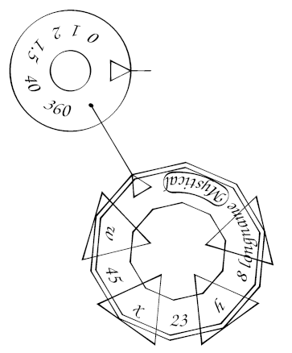
```
[
    0 1 2 1.5 40 360 <<
        /longname (Mystical) /w 45 /h 8 /x 23
    >>
]
```

It is theoretically possible to use `[ ]` and `<< >>` in PostScript in ways that Mystical can't handle:
```
[ 1 2 3 split { ] /first exch def [ } if 4 5 6 ] /final exch def
```
so don't do that.

Other commands like `gsave/grestore` and `begin/end` are more likely to be used in non-balanced or loop-crossing ways so those are treated as normal sigils below.

## Text and Sigils
The rings' rims contain text or sigils.  Sigils are symbols that stand in for operators, variables, or other keywords. Any name, written in PostScript as `/name`, is instead written with a triangle surrounding or superimposing the text of the name or its sigil.  Any strings, written in () in PostScript, are cartouche-like shapes containing the string text.

| array | /array | (array) | foo | /foo | /foobar |
|--|--|--|--|--|--|
|  |  |  |  |  |  |

### Standard Sigils
Many built-in operators have been given their own sigils.  These are used in place of the text of the operator if it appears as a name or operator (but not if it appears as a string).  I have generally made these sigils based on the initial of the command and an illustration of the concept, though in some cases I have taken a more fully illustrative route or created some standard visual language.  Some examples are below - see [Standard Sigils](docs/operators.md) for a full list.

#### Sample sigils

| | | | | | | | |
|:--:|:--:|:--:|:--:|:--:|:--:|:--:|:--:|
|||||||||
|dup|copy|add|mul|neg|for|forall|repeat|
|||||||||
|if|ifelse|eq|ne|ge|gt|le|lt|
|||||||||
|moveto|lineto|arc|arcn|curveto|closepath|stroke|fill|
|||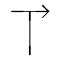||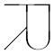|||
|gsave|grestore|translate|scale|rotate|setmatrix|currentmatrix|
||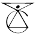|||||||
|setrgbcolor|currentrgbcolor|setcmykcolor|currentcmykcolor|sethsbcolor|currenthsbcolor|setgray|currentgray|
||||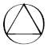|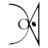|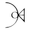||
|dict|begin|end|def|get|put|length|

### User Sigils
Sigils for new functions or names can be added to `sigil_bank` at runtime.  They should fit into the 1-unit square centered on the origin, so no coordinate should be more than 0.5 (of course, you can transform your coordinate system for convenience).  If you use `nstroke` instead of `stroke` you will get the same calligraphic effect as the standard sigils.

Sigils for user variables can be designed with any sigil system.  My examples mostly use letter collision, inspired by Spare's Chaos Magick system, but anything that turns a word into a symbol will work - kameas, wheels, Square Word Calligraphy, Circular Gallifreyan, sitelen sitelen, illustration, puns, etc.  New names based on official operators can incorporate the standard sigils for those operators.

| | | | |
|:--:|:--:|:--:|:--:|
| 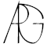 | 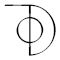 |  |  |
| arg | dot | softscale | nstroke |

## Ligature for `/name { ring } def`

There is a sigil for `def` but a very common pattern is to push a name, push a function, and def the name to the function. To save space and to emphasize this definition, there is special syntax for this case consisting of the usual name triangle with the end of the link line directly below it, and the def sigil is omitted entirely. This is extended to the other two ring types for simplicity. Any other use of `def` will just use the def sigil as normal.

| 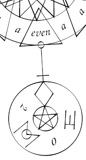 |
|:--:|
| ` { ...  /even { 2 mod 0 eq } def ...  } ` |

This only applies inside of executable arrays. I considered a similar ligature for /name { ring } in dictionaries but there's too much chance of getting it wrong.

## Comments


```
    {
        % Show a standard message, centered horizontally
        gsave
            (Mystical) dup stringwidth pop 2 div neg 0 moveto show
        grestore
    }
```
A comment in Mystical is smaller text in an incomplete text balloon, pointing
to the point in the program where it appears.

Comments in actual PostScript will be dropped before the mystical renderer
can see them, so the mystify.py script changes them to sequences like the
following:

`(Show a standard message, centered horizontally) /mystical_comment_flag pop pop`

which the renderer can detect and display.

## Sample Algorithms

Quicksort is the illustration at the top of this page. 

Euclid's GCD algorithm (using my `/arg {exch def} def` function from dmmlib):

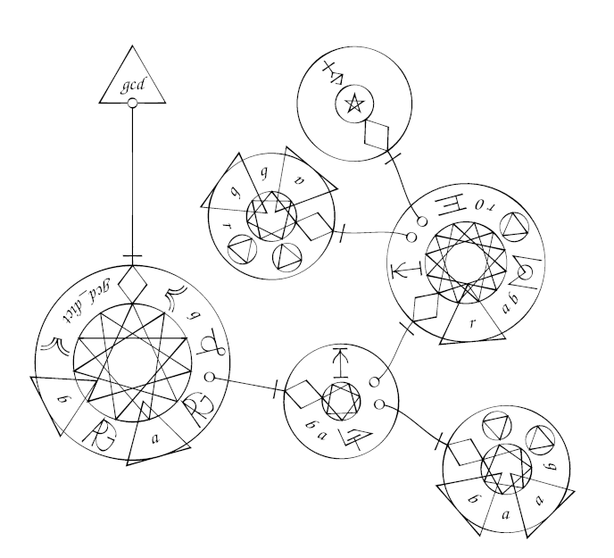

## Functions to generate Mystical images

All of these are defined in "mystical.ps".

`mystical`: takes an array, xarray, or dict and renders it in mystical, descending into substructures as necessary.  The entire image will be scaled to fit into a unit circle.

`mystical_evoke`: The same as `mystical` but it takes a name that is looked up in the current dictionary.

`mystical_evoke_label`:  Like `mystical_evoke` but adds a name-def ligature with the name at the top and orients the image so that the name sigil is right-side-up.

All of these have versions with `_unscaled` appended to them that skip the scaling step.  The rings will be 1 unit thick so the image will be quite large.

For more information on how to use mystical.ps, see [Mystical usage notes](docs/usage.md).

## Programs to generate Mystical images

Currently there is just `mystify.py`, a python script that does two things:

* wraps a PostScript program in code to draw the entire script as a Mystical program, centered on an 8.5x11 page and 8 inches wide
* transform PostScript comments (lines starting with %) into Mystical comments.  Any comments at the very start (such as `%!PS`) will not be transformed, and adjacent lines of comments that are indented the same will be treated as one long comment with newlines in it.

### layout issues
Currently the code figures out the layout of the subcircles so that nothing collides, but it's overly safe so most programs will be very spread out.  For the examples on this page I ran the parsing/layout functions (`mystical_get_spell` and `mystical_make_evocation_ligature`) and then adjusted the results before calling the draw functions `draw_sigil` and `draw_link`.  I'm intending to improve the default layout somewhat.

## Is this a programming language?

At the moment it's a way to draw a PostScript program - there's no interpreter that will ingest a Mystical image and perform the appropriate computation.  It could be run and interpreted by a human, or (more likely) a human could read it and turn it into a PostScript program and run that.  I'll leave further philosophical arguments to other people for now.

## Could this work for other languages?
This approach seems applicable to other language with just operators, such as Forth. Languages with more complicated statements might be more difficult, and I don't know if a new ring for every brace or indent will be overly busy.

