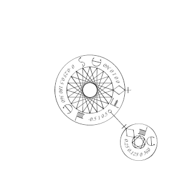

# Getting Started with Mystical

## Installation

Follow the instructions in [Installation of Mystical](../install.md).

## First example

The function `mystical` takes a PostScript object (an xarray, array, or dict) and renders it centered on the origin, fitting in a unit circle.  To see it on a letter-sized or A4 page, making the unit 4 inches wide and putting it in the middle of the page is a good start.

Put this in a file called `first.ps`:
```
%!PS

(mystical.ps) run

72 dup scale    % make the unit 1 inch
4.25 5.5 translate      % move to the center of an 8.5x11 page
4 dup scale     % make the unit 4 inches
{
    0 0 1 0 360 arc stroke
    0 -0.25 0.5 180 360 arc fill
    -0.5 1 0.5 {
        0.25 0.125 0 360 arc fill
    } for
} mystical

showpage
```

Render this with `gstopdf first.ps` or whatever renderer you are using.  You should see something like this:


