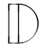
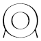
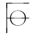
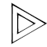
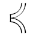
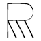
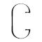
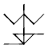
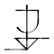
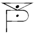

# Standard Sigils
These are the sigils I came up with for built-in operators.
## Operand Stack Manipulation Operators
|||
|:--:|:--:|
|pop|dup|

Unknown: ['exch', 'copy', 'index', 'roll', 'clear', 'count', 'mark', 'cleartomark', 'counttomark']
## Arithmetic and Math Operators
||
|:--:|
|mul|

Unknown: ['add', 'div', 'idiv', 'mod', 'sub', 'abs', 'neg', 'ceiling', 'floor', 'round', 'truncate', 'sqrt', 'atan', 'cos', 'sin', 'exp', 'ln', 'log', 'rand', 'srand', 'rrand']
## Array Operators
|||
|:--:|:--:|
|array|forall|

Unknown: ['[', ']', 'length', 'get', 'put', 'getinterval', 'putinterval', 'astore', 'aload', 'copy']
## Packed Array Operators
||
|:--:|
|forall|

Unknown: ['packedarray', 'setpacking', 'currentpacking', 'length', 'get', 'getinterval', 'packedarray', 'copy']
## Dictionary Operators
||||||
|:--:|:--:|:--:|:--:|:--:|
|dict|begin|end|def|forall|

Unknown: ['<<', '>>', 'length', 'maxlength', 'load', 'store', 'get', 'put', 'undef', 'known', 'where', 'copy', 'currentdict', 'errordict', '$error', 'systemdict', 'userdict', 'globaldict', 'statusdict', 'countdictstack', 'dictstack', 'cleardictstack']
## String Operators
||
|:--:|
|forall|

Unknown: ['string', 'length', 'get', 'put', 'getinterval', 'putinterval', 'copy', 'anchorsearch', 'search', 'token']
## Relational, Boolean, and Bitwise Operators
||||
|:--:|:--:|:--:|
|and|or|xor|

Unknown: ['eq', 'ne', 'ge', 'gt', 'le', 'lt', 'not', 'true', 'false', 'bitshift']
## Control Operators
||
|:--:|
|repeat|

Unknown: ['exec', 'if', 'ifelse', 'for', 'loop', 'exit', 'stop', 'stopped', 'countexecstack', 'execstack', 'quit', 'start']

None: Type, Attribute, and Conversion Operators

None: File Operators

None: Resource Operators

None: Virtual Memory Operators

None: Miscellaneous Operators
## Graphics State Operators (Device-Independent)
|||||||||
|:--:|:--:|:--:|:--:|:--:|:--:|:--:|:--:|
|gsave|grestore|setlinewidth|currentlinewidth|setlinecap|currentlinecap|setlinejoin|currentlinejoin|

Unknown: ['clipsave', 'cliprestore', 'grestoreall', 'initgraphics', 'gstate', 'setgstate', 'currentgstate', 'setmiterlimit', 'currentmiterlimit', 'setstrokeadjust', 'currentstrokeadjust', 'setdash', 'currentdash', 'setcolorspace', 'currentcolorspace', 'setcolor', 'currentcolor', 'setgray', 'currentgray']

None: Graphics State Operators (Device-Dependent)
## Coordinate System and Matrix Operators
||||||
|:--:|:--:|:--:|:--:|:--:|
|currentmatrix|setmatrix|translate|scale|rotate|

Unknown: ['matrix', 'initmatrix', 'identmatrix', 'defaultmatrix', 'concat', 'concatmatrix', 'transform', 'dtransform', 'itransform', 'idtransform', 'invertmatrix']
## Path Construction Operators
|||||||
|:--:|:--:|:--:|:--:|:--:|:--:|
|currentpoint|moveto|lineto|arc|arcn|closepath|

Unknown: ['newpath', 'rmoveto', 'rlineto', 'arct', 'arcto', 'curveto', 'rcurveto', 'flattenpath', 'reversepath', 'strokepath', 'ustrokepath', 'ustrokepath', 'charpath', 'uappend', 'clippath', 'setbbox', 'pathbbox', 'pathforall', 'upath', 'initclip', 'clip', 'eoclip', 'rectclip', 'ucache']
## Painting Operators
|||
|:--:|:--:|
|stroke|fill|

Unknown: ['erasepage', 'eofill', 'rectstroke', 'rectfill', 'ustroke', 'ufill', 'ueofill', 'shfill', 'image', 'colorimage', 'imagemask']

None: Insideness-Testing Operators

None: Form and Pattern Operators

None: Device Setup and Output Operators

None: Glyph and Font Operators

None: Interpreter Parameter Operators
