# Standard Sigils in Mystical

These are the sigils I came up with for built-in PostScript operators.  See [Mystical](../README.md) for more details about this system.
## Structural markings
| | |
|:--:|:--:|
|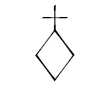|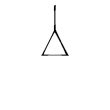|
|RETURN|COMPLETE|

## Operand Stack Manipulation Operators
| | | | | | |
|:--:|:--:|:--:|:--:|:--:|:--:|
|||||||
|pop|exch|dup|copy|index|roll|

No sigils for: clear, count, mark, cleartomark, counttomark
## Arithmetic and Math Operators
| | | | | | | | |
|:--:|:--:|:--:|:--:|:--:|:--:|:--:|:--:|
||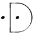|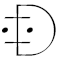||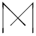||||
|add|div|idiv|mod|mul|sub|abs|neg|
||||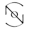||||
|sqrt|atan|cos|sin|rand|srand|rrand|

No sigils for: ceiling, floor, round, truncate, exp, ln, log
## Array Operators
| | | | | | | | |
|:--:|:--:|:--:|:--:|:--:|:--:|:--:|:--:|
|||||||||
|array|length|get|put|getinterval|putinterval|copy|forall|

No sigils for: astore, aload
## Packed Array Operators
| | | | | |
|:--:|:--:|:--:|:--:|:--:|
||||||
|length|get|getinterval|copy|forall|

No sigils for: packedarray, setpacking, currentpacking, packedarray
## Dictionary Operators
| | | | | | | | |
|:--:|:--:|:--:|:--:|:--:|:--:|:--:|:--:|
||||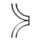|||||
|dict|length|begin|end|def|get|put|copy|
||
|forall|

No sigils for: maxlength, load, store, undef, known, where, currentdict, errordict, $error, systemdict, userdict, globaldict, statusdict, countdictstack, dictstack, cleardictstack
## String Operators
| | | | | | | | |
|:--:|:--:|:--:|:--:|:--:|:--:|:--:|:--:|
|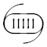||||||||
|string|length|get|put|getinterval|putinterval|copy|forall|

No sigils for: anchorsearch, search, token
## Relational, Boolean, and Bitwise Operators
| | | | | | | | |
|:--:|:--:|:--:|:--:|:--:|:--:|:--:|:--:|
||||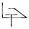||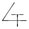||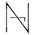|
|eq|ne|ge|gt|le|lt|and|not|
|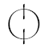||||
|or|xor|true|false|

No sigils for: bitshift
## Control Operators
| | | | | | | |
|:--:|:--:|:--:|:--:|:--:|:--:|:--:|
||||||||
|exec|if|ifelse|for|repeat|loop|exit|

No sigils for: stop, stopped, countexecstack, execstack, quit, start
## Type, Attribute, and Conversion Operators
| | | | | | | | |
|:--:|:--:|:--:|:--:|:--:|:--:|:--:|:--:|
|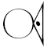|||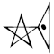|||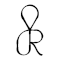|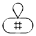|
|type|cvlit|cvx|xcheck|cvi|cvn|cvr|cvrs|
|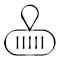|
|cvs|

No sigils for: executeonly, noaccess, readonly, rcheck, wcheck
## File Operators
| | |
|:--:|:--:|
|||
|file|run|

No sigils for: filter, closefile, read, write, readhexstring, writehexstring, readstring, writestring, readline, token, bytesavailable, flush, flushfile, resetfile, status, currentfile, deletefile, renamefile, filenameforall, setfileposition, fileposition, print, =, ==, stack, pstack, printobject, writeobject, setobjectformat, currentobjectformat
## Graphics State Operators (Device-Independent)
| | | | | | | | |
|:--:|:--:|:--:|:--:|:--:|:--:|:--:|:--:|
||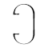|||||||
|gsave|grestore|setlinewidth|currentlinewidth|setlinecap|currentlinecap|setlinejoin|currentlinejoin|
|||||||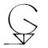||
|setmiterlimit|currentmiterlimit|setdash|currentdash|setcolor|currentcolor|setgray|currentgray|
||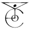||||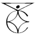|
|sethsbcolor|currenthsbcolor|setrgbcolor|currentrgbcolor|setcmykcolor|currentcmykcolor|

No sigils for: clipsave, cliprestore, grestoreall, initgraphics, gstate, setgstate, currentgstate, setstrokeadjust, currentstrokeadjust, setcolorspace, currentcolorspace
## Coordinate System and Matrix Operators
| | | | | |
|:--:|:--:|:--:|:--:|:--:|
|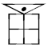|||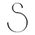||
|currentmatrix|setmatrix|translate|scale|rotate|

No sigils for: matrix, initmatrix, identmatrix, defaultmatrix, concat, concatmatrix, transform, dtransform, itransform, idtransform, invertmatrix
## Path Construction Operators
| | | | | | | | |
|:--:|:--:|:--:|:--:|:--:|:--:|:--:|:--:|
|||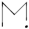||||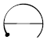||
|newpath|currentpoint|moveto|rmoveto|lineto|rlineto|arc|arcn|
|||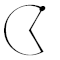||
|curveto|rcurveto|closepath|clip|

No sigils for: arct, arcto, flattenpath, reversepath, strokepath, ustrokepath, ustrokepath, charpath, uappend, clippath, setbbox, pathbbox, pathforall, upath, initclip, eoclip, rectclip, ucache
## Painting Operators
| | |
|:--:|:--:|
||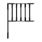|
|stroke|fill|

No sigils for: erasepage, eofill, rectstroke, rectfill, ustroke, ufill, ueofill, shfill, image, colorimage, imagemask
## Device Setup and Output Operators
| |
|:--:|
||
|showpage|

No sigils for: copypage, setpagedevice, currentpagedevice, nulldevice
## Glyph and Font Operators
| | | | | | | |
|:--:|:--:|:--:|:--:|:--:|:--:|:--:|
||||||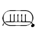||
|findfont|scalefont|setfont|currentfont|selectfont|show|stringwidth|

No sigils for: definefont, composefont, undefinefont, makefont, rootfont, ashow, widthshow, awidthshow, xshow, xyshow, yshow, glyphshow, cshow, kshow, FontDirectory, GlobalFontDirectory, StandardEncoding, ISOLatin1Encoding, findencoding, setcachedevice, setcachedevice2, setcharwidth

## Skipped categories: 
I haven't yet made sigils for any of the operators in these categories:
* **Resource Operators** (defineresource, undefineresource, findresource, findcolorrendering, resourcestatus, resourceforall)
* **Virtual Memory Operators** (save, restore, setglobal, currentglobal, gcheck, startjob, defineuserobject, execuserobject, undefineuserobject, UserObjects)
* **Miscellaneous Operators** (bind, null, version, realtime, usertime, languagelevel, product, revision, serialnumber, executive, echo, prompt)
* **Graphics State Operators (Device-Dependent)** (sethalftone, currenthalftone, setscreen, currentscreen, setcolorscreen, currentcolorscreen, settransfer, currenttransfer, setcolortransfer, currentcolortransfer, setblackgeneration, currentblackgeneration, setundercolorremoval, currentundercolorremoval, setcolorrendering, currentcolorrendering, setflat, currentflat, setoverprint, currentoverprint, setsmoothness, currentsmoothness)
* **Insideness-Testing Operators** (infill, ineofill, inufill, inueofill, instroke, inustroke)
* **Form and Pattern Operators** (makepattern, setpattern, execform)
* **Interpreter Parameter Operators** (setsystemparams, currentsystemparams, setuserparams, currentuserparams, setdevparams, currentdevparams, vmreclaim, setvmthreshold, vmstatus, cachestatus, setcachelimit, setcacheparams, currentcacheparams, setucacheparams, ucachestatus)

My thanks to Andrew Plotkin for inventing the basic form of the symbol I used for xor, in another context.
    